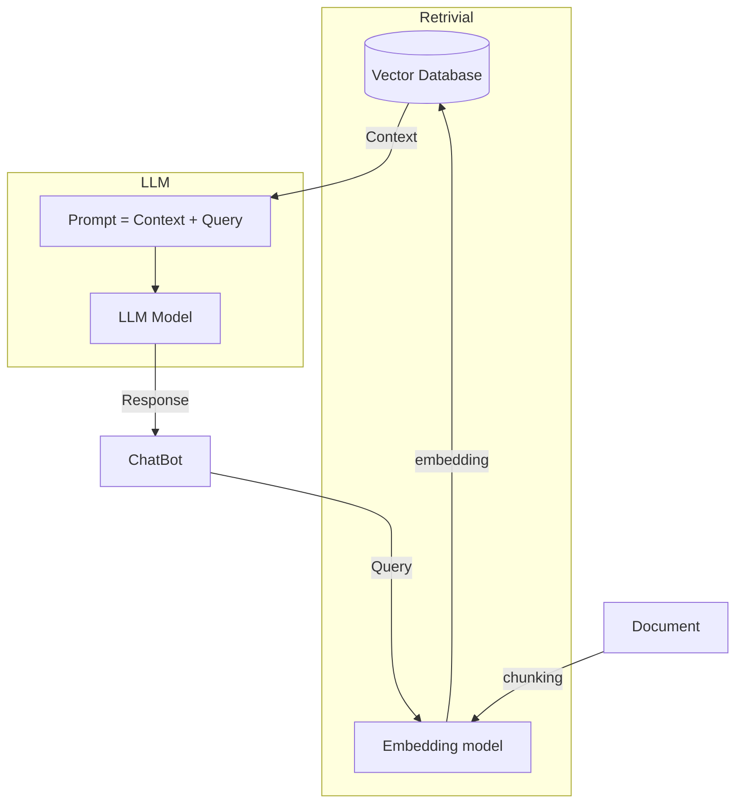

# Overview

This backend application is designed to create a Retrieval-Augmented Generation (RAG) system. The system processes various types of input data, such as Word documents, Excel files, images, and text, by chunking them into token vectors and storing them in a vector database.

the flow should be like this:

# About Embedding Model

- The data to be embedded is large, but for proof-of-concept purposes, free models like BGE Models and Qodo-Embed-1 will be used.
- The backend is implemented in Python.
- The LLM model is wrapped in a Rust library, which communicates with Python via API calls. The Rust library takes a prompt (context + query) as input and returns the generated response.
- The response is then sent to the chatbot on the frontend.
- LanceDB is chosen as the vector database due to its suitability for handling vector data.

# Data Processing

- The system supports processing various data types, including PDFs, text files, Word documents, Markdown files, Excel sheets, and optionally images. It is designed to be extensible to other data types.
- Please note that all the document can be any kind and even mixing together
- Raw data is chunked into smaller pieces suitable for vectorization.
- The speed of data reading, analysis and chunking must be consider 

I want to build Multi model Content parsing, the structure content list was
- Hierachical Text Extraction
- Image Caption and metadata extraction 
- Latex quation recognition 
- Table structure and content parsing  

# Core Algorithm

📄
Document Parsing
→
🧠
Content Analysis
→
🎯
Intelligent Retrieval